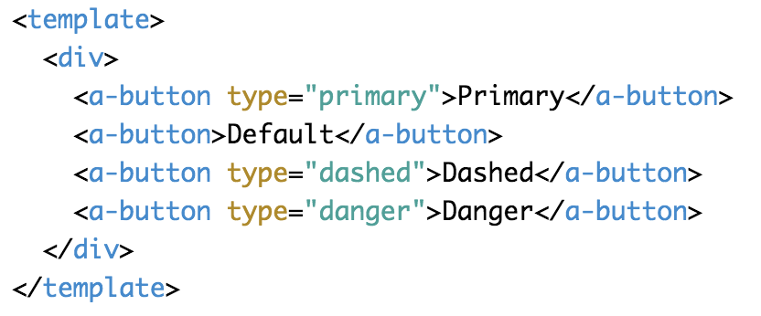
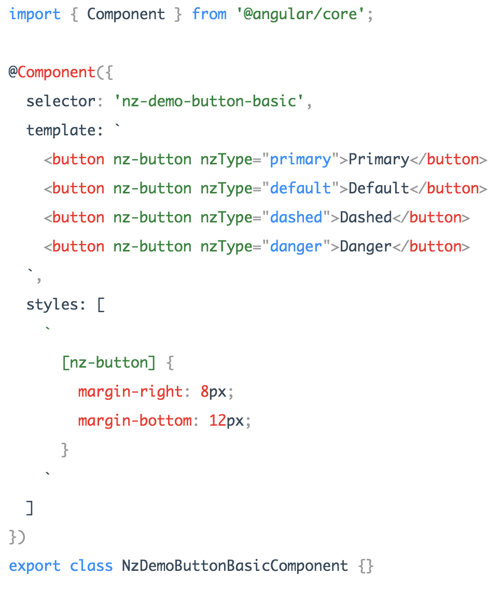
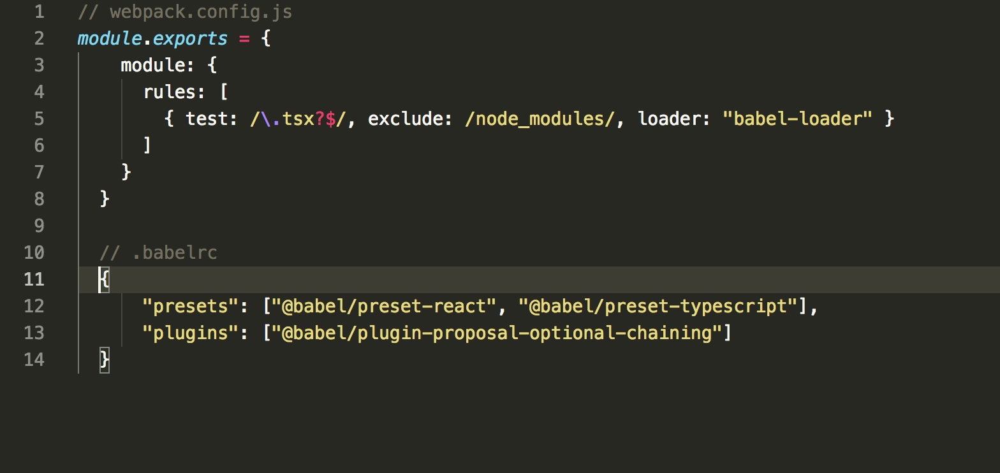
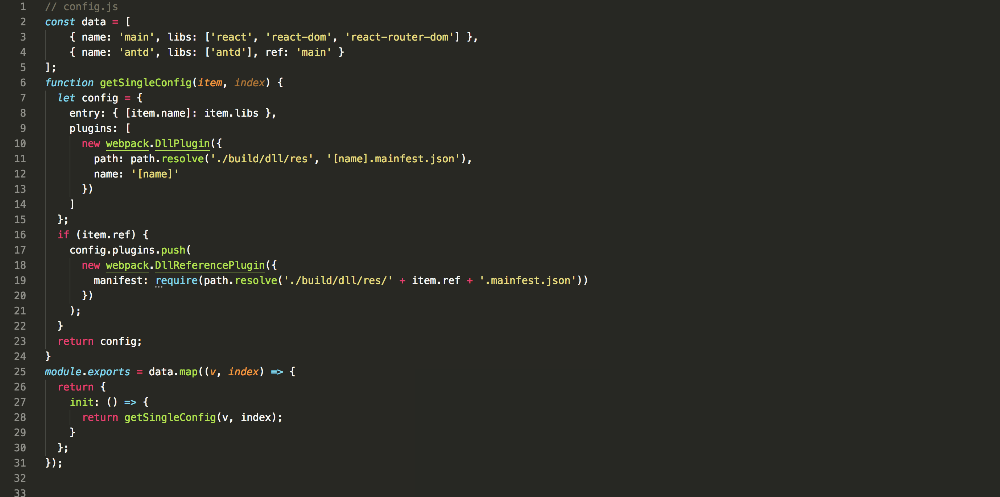
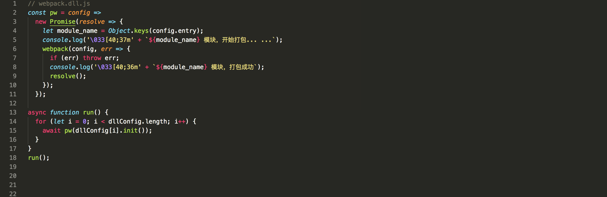
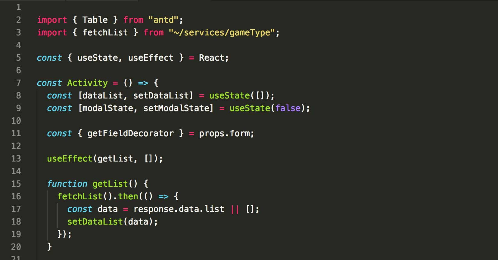
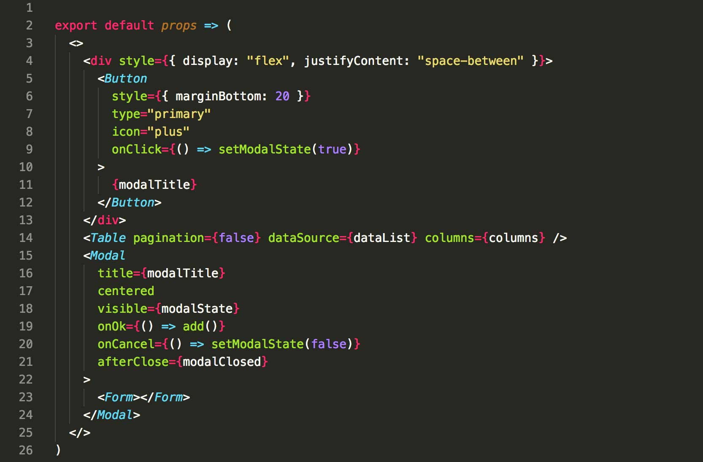
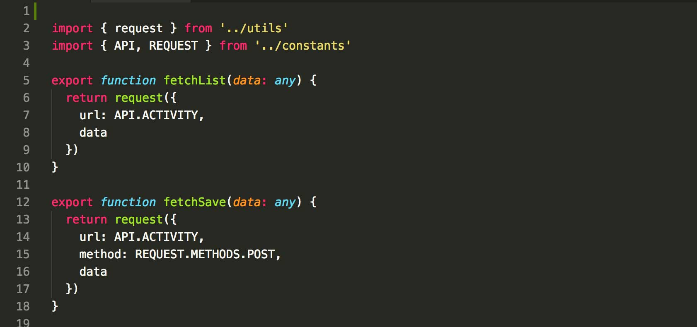

title: 《 React + Antd 》
speaker: liurongqing
url: https://github.com/liurongqing/ppt
css: 
    - ./css/custom_main.css

<slide class="aligncenter">

# React+Antd {.text-landing.text-shadow}

#### 构建高可用的、易开发、优雅的后台管理系统

By liurongqing {.text-intro}

</slide>

<slide class="aligncenter">
## :fa-superpowers: 三大框架后台选择

:::flexblock {.clients}


### React

- `dva + Antd`
- `create-react-app + Antd`
- `Ant Design Pro`
- `webpack + Antd（推荐）`

---


### Vue

- `Vue-CLI + Element（推荐）`
- `Vue-CLI + iView`
- `vue-element-admin`
- `vue-admin-template`

---


### Angular

- `Angular + Material`
- `angular-material-app`
  :::

</slide>

<slide class="aligncenter">
####  :fa-code: 三个框架对于 ANTD 的按钮的代码演示
---
:::flexblock {.clients}


### Ant Design


---


### Ant Design Vue



---


### NG-ZORRO



:::

</slide>

<slide>
##  :fa-bold: 构建系统几个核心点

---

- :构建工具\::{.text-label} `Grunt`, `Gulp`, `Webpack`, `Rollup`, `Parcel`
- :TypeScript\::{.text-label} `类型检测`, `友好提示`, `直观的api`
- :代码规范\::{.text-label} `JSLint`, `ESLint`, `TSLint`, `Prettier`
- :路由管理\::{.text-label} `react-router-dom`, `@angular/router`, `vue-router`
- :常用辅助函数\::{.text-label} `clone`, `getQueryString`, `tree`, `unique`, `uuid`
- :目录结构\::{.text-label} `MVC式`, `脚手架`
- :开发文档\::{.text-label} `框架`, `规范`, `模板`, `业务`
- :单元测试\::{.text-label} `JEST`, `Mocha`

{.description}

</slide>

<slide :class="size-80">

## :fa-building-o: 构建工具（webpack）

1. 创建编写 `package.json` 文件
2. 安装配置 `webpack`
3. webpack dllPlugin 配置与使用

---



</slide>

<slide class="aligncenter">
## webpack dllPlugin（配置）
---


</slide>

<slide class="aligncenter">
## webpack dllPlugin（使用）

---



</slide>

<slide :class="text-pull">
:::card
- :fa-folder: build
  - :fa-folder: dll
  - :fa-file: webpack.config.js
- :fa-folder: docs
- :fa-folder: src
  - :fa-folder: constants
  - :fa-folder: containers
  - :fa-folder: components
  - :fa-folder: layouts
  - :fa-folder: pages
  - :fa-folder: services
  - :fa-folder: styles
  - :fa-folder: utils

---


:::
</slide>

<slide>
:::card


---

## :fa-windows: TypeScript

1. 类型约束，友好提示
   

2. 可用的新特性
   

3. 一个最直接的 api 文档
   
   :::
   </slide>

<slide>
## :fa-code: 代码规范（Prettier + EditorConfig）
:::gallery


### .Prettier 配置

安装 Prettier - Code formatter 扩展

---


### .editorconfig 配置

安装 Prettier - Code formatter 扩展

:::
</slide>

<slide>
## :fa-link: 路由管理（react-router-dom）
:::gallery


### 路由对象

单页与内嵌页组合

---


### 路由主配置

一级路由配置

---


### 路由子配置

二级子路由配置
:::
</slide>

<slide>
## :fa-question-circle: 常用辅助函数
---
:::shadowbox
## clone 函数
```javascript
export default data => { }
```
---
## getQueryString 函数
```javascript
export default name => { }
```
---
## tree 函数（无限分类）
```javascript
export default (data, pid = '0') => { }
```

:::
</slide>

<slide class="aligncenter size-90">
## :fa-edit: 编写 constants（1/3）
---

</slide>

<slide class="aligncenter size-80">
## :fa-edit: 编写 components（2/3）
---

</slide>

<slide class="aligncenter size-90">
## :fa-edit: 编写 services（3/3）
---

</slide>

<slide class="aligncenter">
## :fa-book: 简易后台系统图

---


</slide>

<slide class="aligncenter">
# Think You!

[:fa-github: Github](https://github.com/liurongqing/ppt/tree/gh-pages){.button.ghost.animated.delay-1s.fadeInUp}
</slide>

```

```
