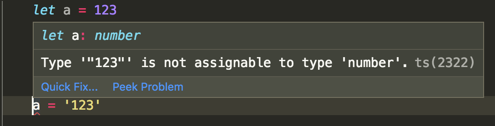
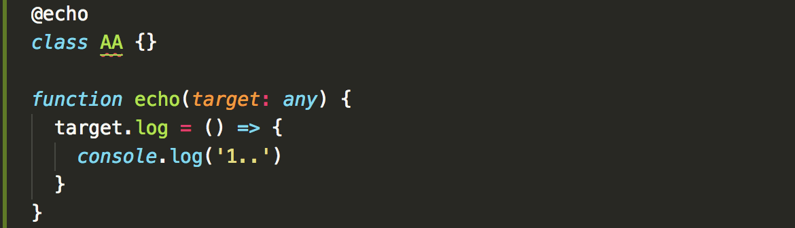
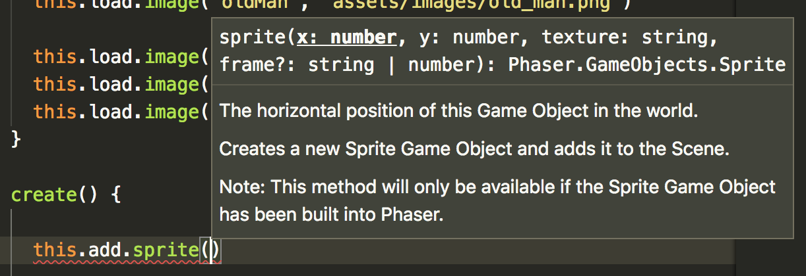
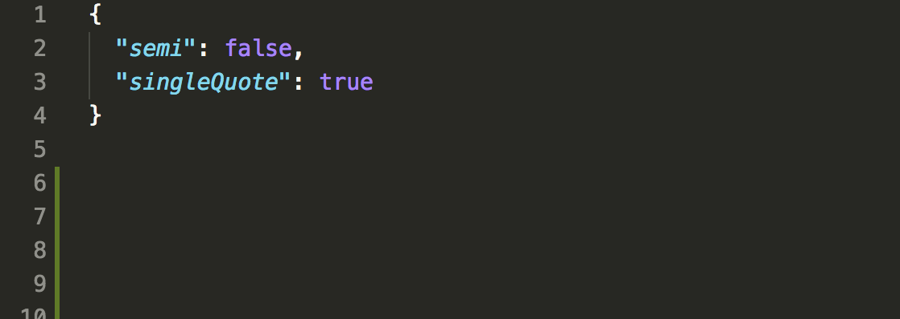
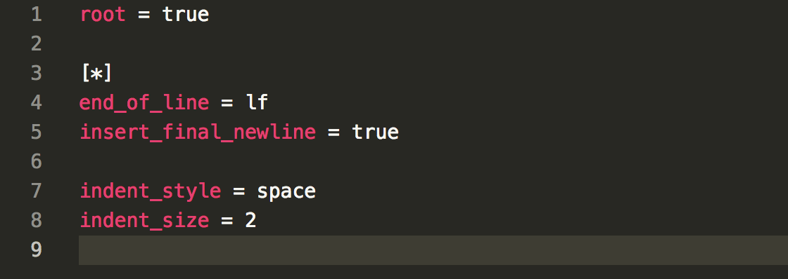
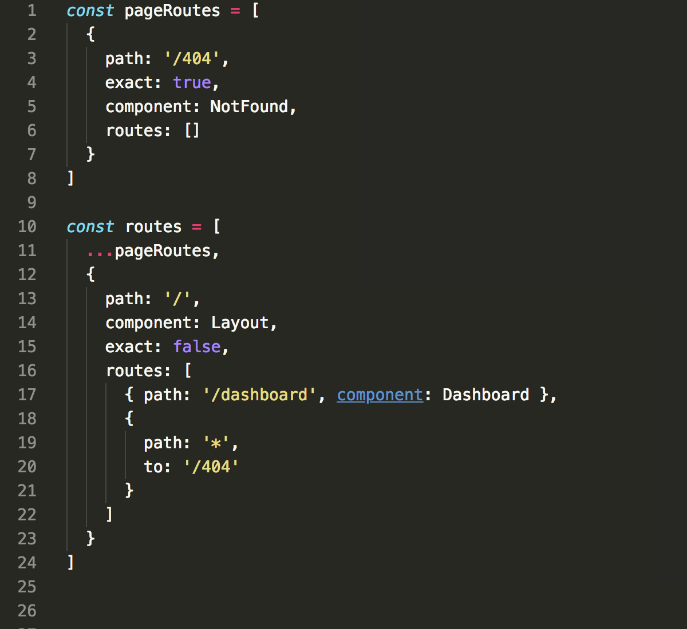
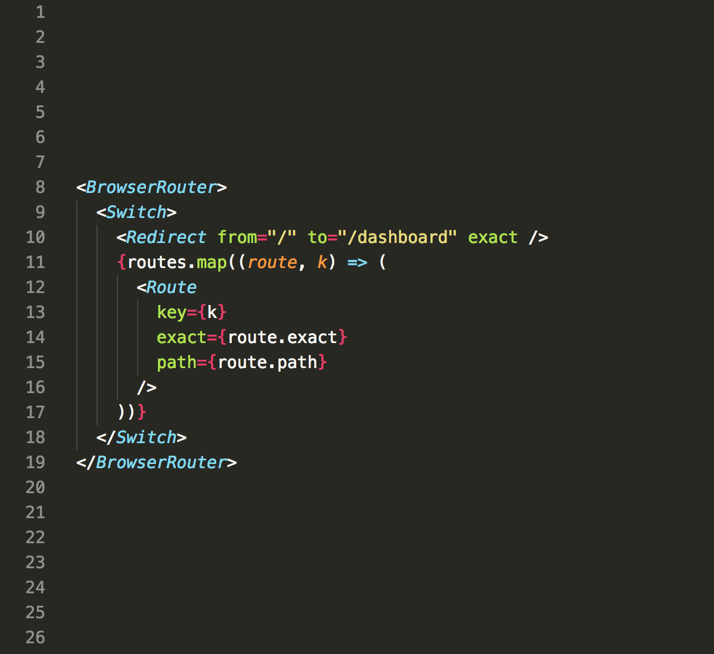
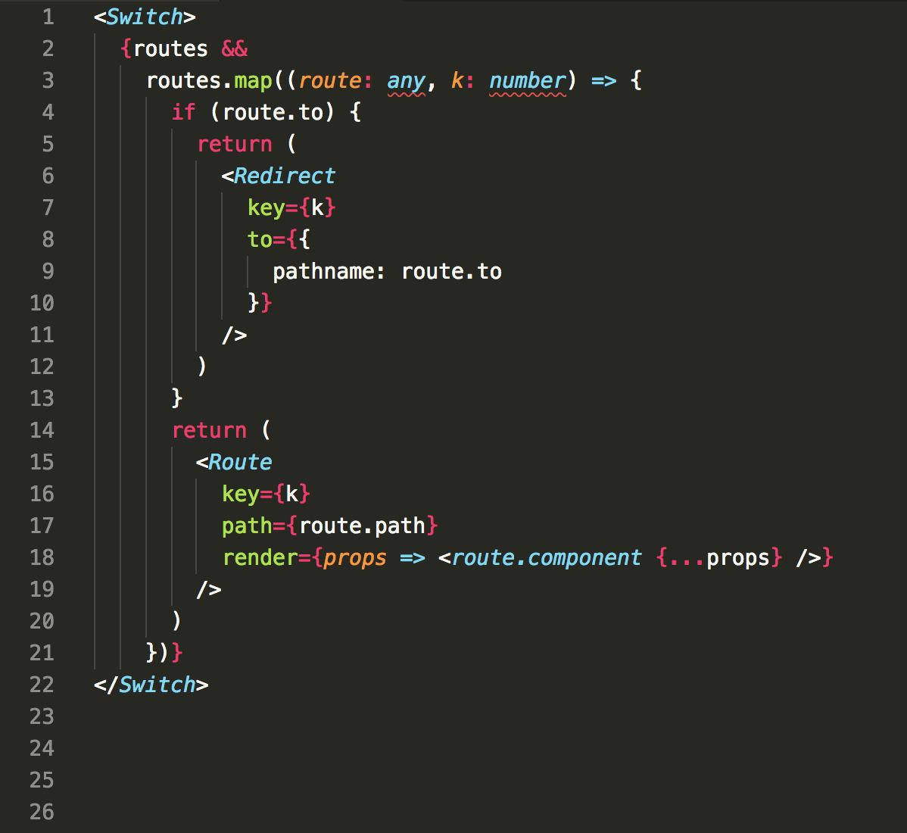

title: 《 React + Antd 》
speaker: liurongqing
url: https://github.com/liurongqing/ppt

<slide class="aligncenter">

# React+Antd {.text-landing.text-shadow}

#### 构建高可用的、易开发、优雅的后台管理系统

</slide>

<slide class="aligncenter">
# 三大框架

:::flexblock {.clients}


### React

dva + Antd

create-react-app + Antd

Ant Design Pro

webpack + Antd

---


### Vue

Vue-CLI + Element(iView)

vue-element-admin

---


### Angular

Angular + Material
:::

</slide>

<slide :class="size-50">
## 基于 React 构造系统几个核心点

---

1. 构建工具（webpack){.shake}
2. 目录结构{.shake}
3. TypeScript{.shake}
4. 代码规范（Prettier + EditorConfig）{.shake}
5. 路由管理（react-router-dom）{.shake}
6. 常用辅助函数 {.shake}

{.text-cols.build}

</slide>

<slide :class="size-80">

:::column {.vertical-align}

## 构建工具（webpack）

编译 ES6 代码，打包压缩代码，提供本地开发环境。

1. 创建编写 `package.json` 文件
2. 安装配置 `webpack`
3. dllPlugin 使用

---

```bash
yarn init
```

```javascript
{
    "scripts": {
        "start": "webpack-dev-server --open --config build/webpack.dev.js",
        "prod": "webpack --config build/webpack.prod.js",
        "dll": "node build/webpack.dll.js"
    }
}
```

:::
</slide>

<slide>
:::card
## 目录结构
- :fa-folder: build
  - :fa-folder: dll
  - :fa-file: webpack.common.js
  - :fa-file: webpack.dev.js
  - :fa-file: webpack.prod.js
  - :fa-file: webpack.dll.js
- :fa-folder: docs
- :fa-folder: src
  - :fa-folder: constants
  - :fa-folder: containers
  - :fa-folder: components
  - :fa-folder: layouts
  - :fa-folder: pages
  - :fa-folder: services
  - :fa-folder: styles
  - :fa-folder: utils

---


:::
</slide>

<slide>
:::card


---

## TypeScript

1. 类型约束，友好提示
   

2. 可用的新特性
   

3. 一个最直接的 api 文档
   
   :::
   </slide>

<slide>
## 代码规范（Prettier + EditorConfig）
:::gallery


### .Prettier 配置

安装 Prettier - Code formatter 扩展

---



### .editorconfig 配置

安装 Prettier - Code formatter 扩展

:::
</slide>

<slide>
## 路由管理（react-router-dom）
:::gallery


### 路由对象

单页与内嵌页组合

---



### 路由主配置

一级路由配置

---



### 路由子配置

二级子路由配置
:::
</slide>

<slide>
## 常用辅助函数
---
:::shadowbox
## clone 函数

```javascript
// clone.js
export default (data: any) => JSON.parse(JSON.stringify(data));
```

---

## getQueryString 函数

```javascript
export default (name: String) => {
  var reg = new RegExp('(^|&)' + name + '=([^&]*)(&|$)', 'i') // 匹配目标参数
  var result = window.location.search.substr(1).match(reg) // 对querystring匹配目标参数
  if (result != null) {
    return decodeURIComponent(result[2])
  } else {
    return null
  }
}
```

<!-- ---

## tree 函数（无限分类）

```javascript
export default ({ data, pid = '0', columns }: any) => {
  const newData = clone(data)
  const getTree = (data: any, pid: any) => {
    let tree = []
    for (let i = 0; i < data.length; i++) {
      if (data[i].parentId === pid) {
        data[i].children = getTree(data, data[i]._id)
        if (data[i].children.length == 0) {
          delete data[i].children
        }
        if (columns) {
          for (let j in columns) {
            if (Array.isArray(columns[j]) && columns[j].length > 0) {
              columns[j].forEach((v: any) => {
                data[i][v] = data[i][j]
              })
            } else {
              data[i][columns[j]] = data[i][j]
            }
          }
        }

        tree.push(data[i])
      }
    }
    return tree
  }
  return getTree(newData, pid)
}
​``` -->

:::
</slide>

<slide class="aligncenter">
# 简易、优雅的后台系统（完整）

</slide>

<slide class="aligncenter">
# 谢谢

[:fa-github: Github](https://github.com/liurongqing/ppt){.button.ghost.animated.delay-1s.fadeInUp}
</slide>

```